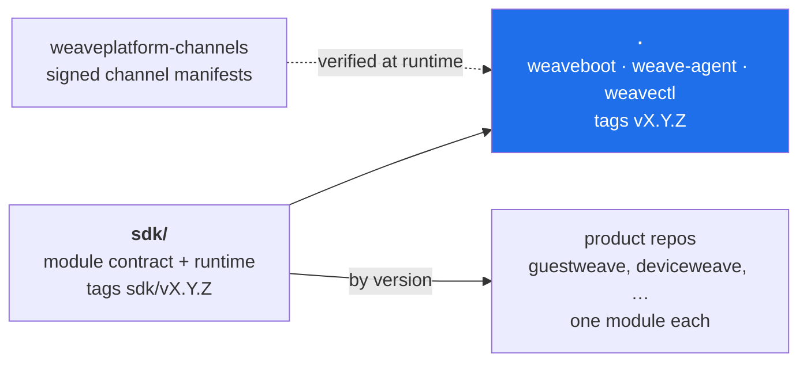

# weaveplatform-agent

One agent, any device, physical or virtual. It presents a single install footprint, a single
enrolment and a single identity to an administrator, and behind that runs one module per Weave
product that has a device-side half.

**Core is infrastructure with no opinion about what the platform does.** It knows how to be one
authenticated, policied, supervised presence on a machine. **Modules are products** — separate
signed binaries, owned by product teams, shipped on their products' release trains, fetched and
promoted at runtime. Core launches them Terraform-style: verify signature, spawn, handshake,
speak gRPC over a local socket for the process lifetime.

The full architecture lives in [`spec.md`](spec.md) — read it before changing anything
here. [`docs/architecture.md`](docs/architecture.md) shows what was built and how the pieces
relate (with diagrams); [`docs/development.md`](docs/development.md) covers local setup,
running the agent, and the release pipeline.

## Layout

One repository, two Go modules. The sdk is what a module builds against and is tagged on
its own (`sdk/vX.Y.Z`) so a module can pin it independently of core; core builds the sdk it
ships with. Products live in their own repositories and pin the sdk by version.



| Path | What |
|---|---|
| `cmd/weave-agent` | Core: the supervised, enrolled presence on the machine |
| `cmd/weaveboot` | Supervises core so core can be replaced in place — staged, health-gated, with rollback |
| `cmd/weavectl` | Operator CLI over the control socket |
| `cmd/weavemanifest` | Mints and verifies the channel-manifest signing chain — verify *is* `internal/manifestverify`, so a manifest it accepts is one core accepts |
| `internal/supervise` | Module supervision: verify-before-exec, privilege drop, handshake, health, crash-loop breaker |
| `internal/lifecycle` | Module install: fetch, stage, health-gated promote, N-1 retention, rollback |
| `sdk/` | The module SDK, a nested Go module (`…/weaveplatform-agent/sdk`): `modulesdk`, `handshake`, `ipc`, `platform`, the generated protocol under `gen/`, `manifest` types, `hvchannel`. Everything a module imports, nothing it should not — see [`sdk/README.md`](sdk/README.md) |
| `modules/sysinfo` | The platform's own module and the template every product module is copied from; a nested Go module (tags `modules/sysinfo/vX.Y.Z`) that pins the sdk by version like any product would, and releases through the same reusable pipeline |
| `proto/`, `schema/` | The sources `sdk/gen` and the manifest JSON Schemas are generated from; `buf generate` regenerates and CI fails on drift |
| `test/protocompat` | The test that matters: core at protocol N accepts an N-1 module and cleanly refuses N-3 |

## Building

```sh
CGO_ENABLED=0 go build ./...              # core; builds the sdk it ships with (replace => ./sdk)
cd sdk && CGO_ENABLED=0 go build ./...    # the sdk on its own recorded pins — what a module author gets
```

Zone A throughout: static, no cgo, macOS + Windows + Linux. Modules pin the sdk with
`require github.com/deploymenttheory/weaveplatform-agent-core/sdk vX.Y.Z`. `go install
…/cmd/weavectl@vX` is not supported — the root `go.mod` carries a `replace`, which `go install
pkg@version` refuses; binaries ship as goreleaser archives and the deb.

Core is the single point of failure for the whole product line. That is the argument for
keeping it aggressively boring.
