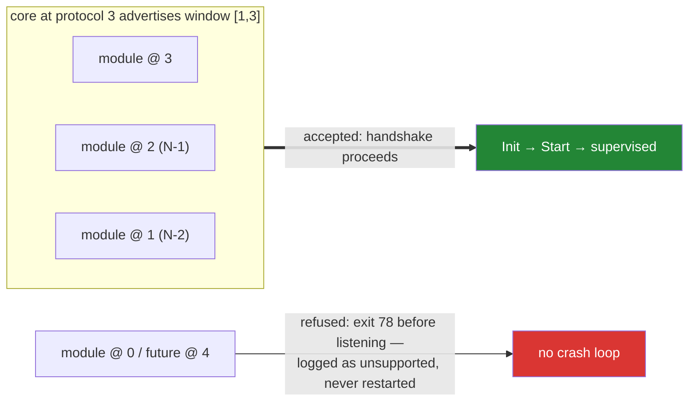

# The protocol

Three numbers version this platform: core's semver, each module's product semver, and **the
protocol integer** between them. This document owns the integer.

## What the integer is

The protocol is the wire contract a module builds against: the proto package `weave/agent/v1`,
the handshake environment and stdout line, and the capability vocabulary. Proto package `v<N>`
**is** protocol N. (The `go-bindings-*` versions are pinned separately, in the channel
manifest — see Bindings pinning below.)

Core advertises `{min, max}` at spawn (`WEAVE_PROTOCOL_MIN`, `WEAVE_PROTOCOL_MAX`). Each module
declares the single protocol it speaks. Compatibility is negotiated at handshake, never
tabulated. **An N-2 window is the default**: core at protocol N accepts modules built against
N-1 and N-2 and cleanly refuses anything older.



The refusal path is as designed as the acceptance path: `test/protocompat` in
weaveplatform-agent keeps a module frozen at each protocol and proves both directions on
every CI run, forever.

## What bumps the integer

A protocol bump is rare and deliberate — a design review, not a side effect. Bump when:

- a wire-visible message or RPC changes incompatibly (buf breaking-change checks gate this);
- the handshake environment or stdout line changes shape;
- the capability vocabulary changes meaning (adding a new capability name is *not* a bump).

A `go-bindings-*` version change is **not** a protocol bump — it is a channel event (see
Bindings pinning).

A bump means a new proto package (`weave/agent/v2`) beside the old one. Core serves both for
the length of the window. The old package is deleted only when it falls out of the window.

## What does not bump the integer

- Adding an optional field to an existing message.
- Adding a new capability name (modules that require it simply don't launch on hosts without it).
- Core releases. Module releases. Anything semver'd.

## Bindings pinning

The `go-bindings-*` versions the current protocol expects are recorded in the channel
manifest's `bindings` block and version on **their own cadence** — a bindings bump is a
*channel* event (re-sign the manifest), not a protocol-integer bump and not a proto-package
fork. Decoupling the two keeps a library refresh from forcing every module to rebuild against
a new `weave/agent/vN` when no wire byte changed. The integer moves only for wire-visible
changes (see above); the manifest's `bindings` block is where "which library the fleet runs"
is pinned and rolled.

## Additive change, worked example

The policy envelope (`schema_version`, `content_type` on `PolicyDocument`), event sequence
numbers (`sequence` on `Event`), and the standard `grpc.health.v1` service were all added
under protocol **1**: new optional fields and a new service are wire-compatible, so by the
rules above they do not bump the integer. A protocol-2 package is minted only when a genuinely
breaking change lands, at which point `test/protocompat/v2` is added beside `v1`.

## The handshake

```
core → module    env: WEAVE_PROTOCOL_MIN, WEAVE_PROTOCOL_MAX, WEAVE_HANDSHAKE_TOKEN,
                      WEAVE_HOST_ADDR, WEAVE_SOCKET_DIR
module → core    stdout, one line:  WEAVE|1|<protocol>|<network>|<addr>
core → module    gRPC ModuleService.Init on <addr>
module → core    gRPC dial WEAVE_HOST_ADDR presenting the one-time token
```

The leading `1` in the stdout line is the *handshake format* version, distinct from the
protocol integer that follows it. A module whose protocol falls outside the advertised window
must exit with code 78 (EX_CONFIG) before listening; core records "protocol unsupported" and
does not restart it — refusal is clean, never a crash loop.

## Registry

| Protocol | Proto package | Status | Notes |
|---|---|---|---|
| 1 | `weave/agent/v1` | current | initial protocol |
