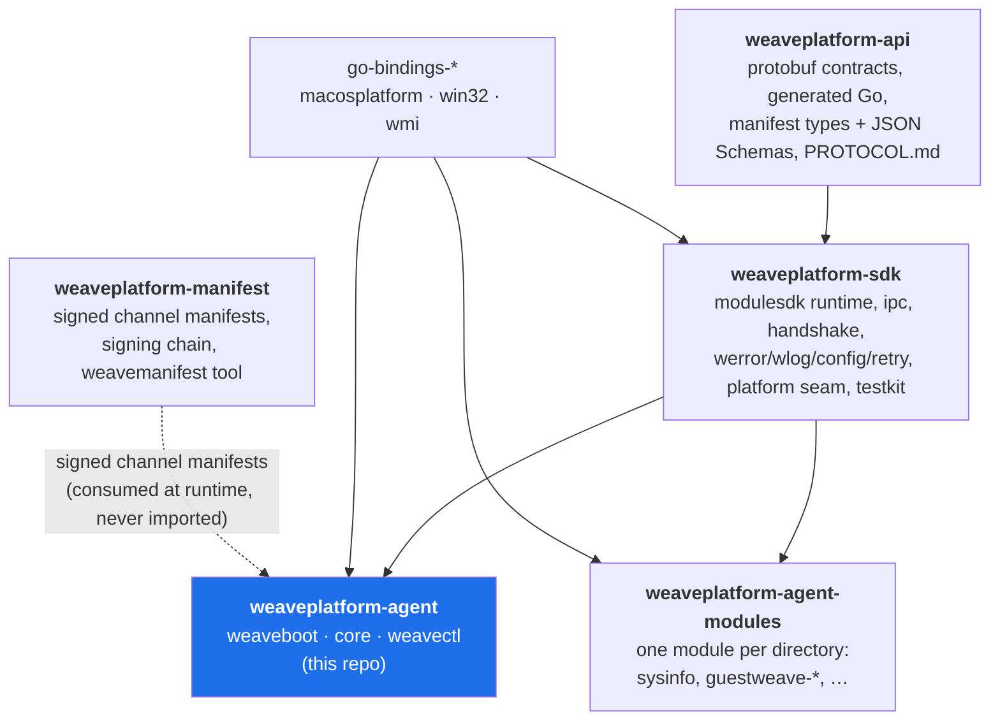
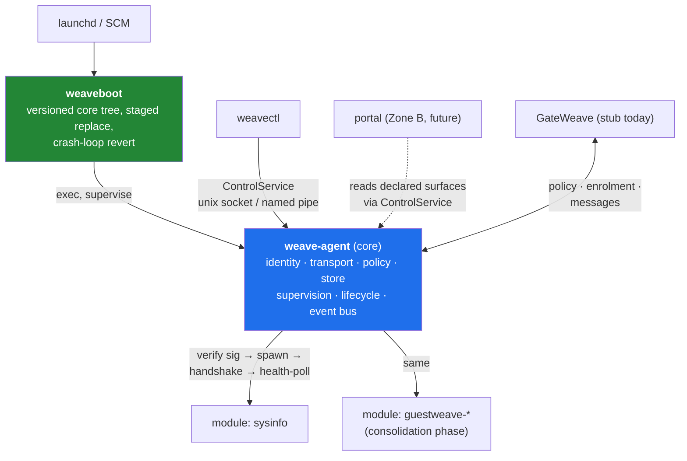
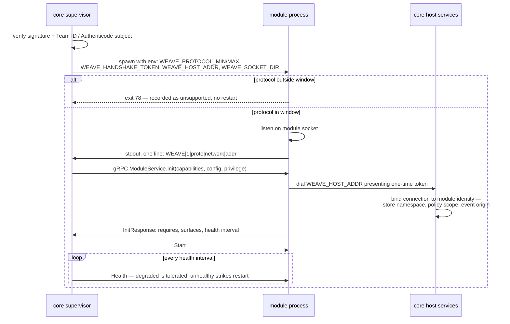
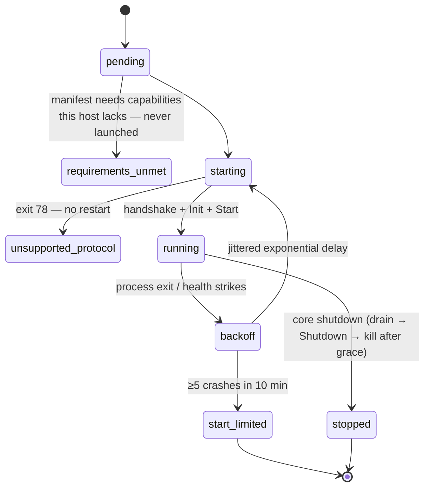
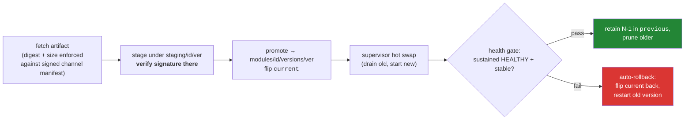
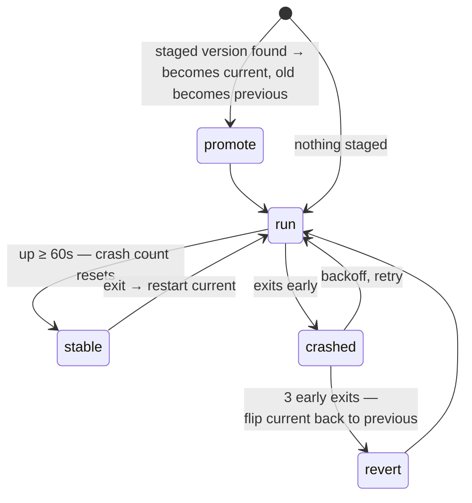

# Architecture

How the Weave platform agent is put together. [`spec.md`](../spec.md) is the governing
document — this explains what was built and how the pieces relate. The one-line summary: one
agent, any device; **core is the surface, modules are the products**.

## The repositories

Five repositories, one dependency direction. Nothing imports downward, core and modules never
import each other, and anything two products share moves up.

`weaveplatform-manifest` is deliberately not a Go dependency of anything: core consumes its
*documents* over HTTP and verifies them against a root key baked into core
(`internal/manifestverify`). A signing CVE is a core patch, not an SDK rebuild.

## Process model

Modules are separate binaries — Go cannot run in-process code built at a different time from
its host, so independent module versioning forces a wire boundary. The model is Terraform's:
launch a verified binary, handshake, speak gRPC over a local socket for the process lifetime.

Three processes core does not parent: **weaveboot** (supervises core so it can replace it —
the relationship inverts), the **portal** (session lifecycle belongs to launchd), and any
**System Extension** (the OS owns it). Everything else is core's child; on Windows a Job
Object with kill-on-close guarantees module trees die with core.

## The handshake

Protocol compatibility is negotiated, never tabulated. Core advertises a `{min,max}` window;
each module speaks exactly one protocol integer. An out-of-window module exits with code 78
before listening — clean refusal, never a crash loop.

All host-service auth is per-connection: the token rides every RPC as metadata, and the
socket itself lives in a 0700 directory (SDDL-ACL'd pipe on Windows). A module cannot name,
let alone reach, another module's namespace.

## Supervision

Each module runs under a per-module state machine (`internal/supervise`). It fails closed: a
module that cannot run safely does not run.

The start limit (systemd's `StartLimitBurst`, not a Fowler circuit breaker — there is no
half-open probe) pins the module down rather than restarting forever; a rollback or operator
action resets it. Crash counts only reset after the module proves stable (60s up).

Liveness is watched two ways. Core **polls** `ModuleService.Health` on the module's requested
cadence, and the module **pushes** a watchdog ping (the sd_notify WATCHDOG shape) over
`WatchdogService` every interval core sets in `InitRequest`. A module silent past two
intervals is restarted — a proactive signal that catches a module which can no longer
maintain its keepalive stream, without waiting on the next poll.

## Module install: stage → promote → rollback

The lifecycle manager (`internal/lifecycle`) owns install. Verify-before-exec is
non-negotiable: modules are fetched after install, so Gatekeeper and SmartScreen protect
nobody here.

The same shape applies one level up: **weaveboot** replaces core itself. An updater leaves a
new core under `core/staging/`; weaveboot promotes it at loop start and reverts a version
that cannot stay up. A promoted core is confirmed on **readiness, not uptime**: once modules
are registered and the control socket is up, core writes a readiness marker weaveboot cleared
before launch, so its presence proves the new core loads and configures — a fast, health-based
promotion gate, with the uptime timer as the fallback. The installed footprint (launchd plist,
service registration, signing identity — see [`../pkg/README.md`](../pkg/README.md)) never
changes; only the binaries behind it do.

## Core's internal layout

| Package | Owns |
|---|---|
| `internal/supervise` | spawn, verify-before-exec, handshake, health, backoff, start limit, Job Objects |
| `internal/hostserv` | per-module gRPC host services, token-gated: store, policy, events, identity, transport |
| `internal/store` | one bbolt file, bucket per namespace, AES-256-GCM per value (namespace+key as AAD), master key sealed by `keyprotect` (DPAPI / keyfile → Secure Enclave/TPM later) |
| `internal/policy` | fetch from GateWeave, cache in store for offline restarts, wake Watch streams on change |
| `internal/identity` | Ed25519 device identity behind a Provider seam, enrolment, per-module scoped credentials |
| `internal/transport` | peer mux (GateWeave HTTP peer, hypervisor channel), durable offline queue |
| `internal/lifecycle` | staged install, health-gated promote, N-1 retention, rollback |
| `internal/manifestverify` | two-tier Ed25519 chain verification for channel manifests |
| `internal/capability` | the one host probe at startup that gates module launch |
| `internal/eventbus` | at-most-once in-core pub/sub — the only lateral channel between modules |
| `internal/weaveboot` | versioned core tree, staged replace, crash-loop revert |
| `internal/controlsock` | ControlService for weavectl and (later) the portal |

## The test that matters

`test/protocompat/v1` is a module frozen at protocol 1 — pinned go.mod, built with
`GOWORK=off` so the pins decide what it links. Every CI run proves current core accepts it
in-window and refuses it cleanly once the window moves past it. When protocol 2 ships, `v2/`
is added beside it; `v1/` is never deleted. That property — negotiated compatibility that is
continuously proven — is what makes independent module versioning an asset instead of a
liability.

## The hypervisor channel

Inside a guest, core owns one connection to the host tooling outside it — a
virtio-serial device, vsock, or HvSocket, whichever the capability probe found.
Modules never see framing or device nodes: they `Send` and `Receive` messages
addressed to `PEER_HYPERVISOR`, and core translates.

The framing lives in `weaveplatform-api/hvchannel` rather than here, because the
host end must encode identically and **nothing on that wire would catch a
mismatch** — no negotiation, no version exchange, so a field renamed on one side
just stops matching and the symptom is a guest that never answers.

Core owns exactly one connection because the frame protocol has **no
resynchronisation**: a second reader desynchronises the stream permanently rather
than degrading it. One fd, one read loop, one write mutex.

A frame that will not decode costs one message, not the channel — the length
prefix has already kept the reader aligned, so the loop logs and continues. Only
a stream-level failure ends it. Getting that classification backwards would let
one malformed frame silently kill a channel core cannot re-establish, with the
guest still looking healthy.

`weaveplatform-agent-modules/guestweave-*` is what runs on the other side of it.

## What is deliberately not here yet

- **Portal (Zone B)** — UI surfaces are already declared as data and brokered through
  ControlService; nothing draws yet.
- **Zone C** (System Extensions, cgo) — the capability probe and manifest zone field are the
  seams.
- **GateWeave** — `test/stubgateweave` defines the contract core programs against.
- **Per-user session supervision** — the supervisor rejects non-`system` sessions today.
  Clipboard, display and input need it, and it is a second lift on core.
