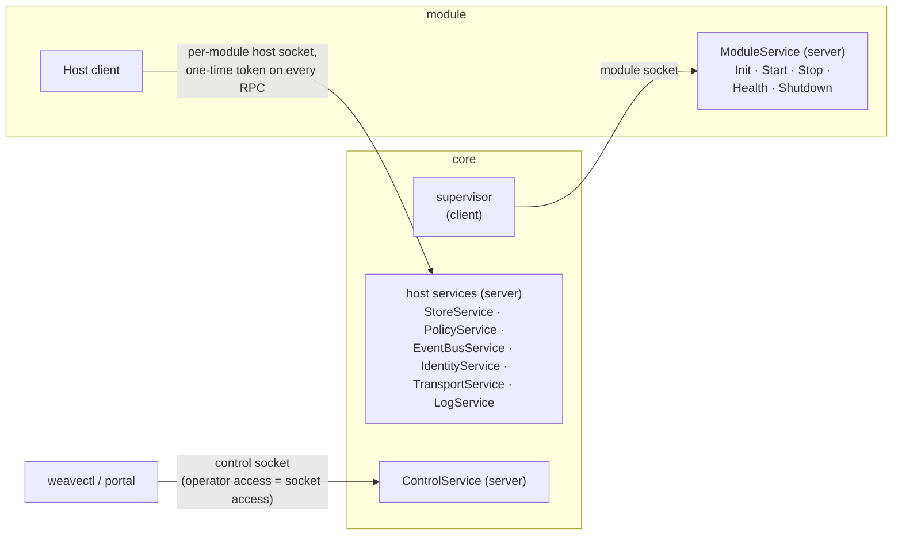

# Service map

Protocol 1's gRPC surface and who serves what. The direction matters: the **module serves
one service** (core is its only client); **core serves everything else** on a per-module
socket whose OS permissions match the module's dropped privilege.

| Proto | Service | Served by | Notes |
|---|---|---|---|
| `weave/agent/v1/module.proto` | `ModuleService` | module | lifecycle sequencing enforced by the SDK runtime |
| `weave/agent/v1/store.proto` | `StoreService` | core | namespace bound to the connection, never in a request |
| `weave/agent/v1/policy.proto` | `PolicyService` | core | `Watch` streams the current doc immediately, then on change |
| `weave/agent/v1/events.proto` | `EventBusService` | core | topics prefixed with the publisher's id by core |
| `weave/agent/v1/identity.proto` | `IdentityService` | core | module-scoped credentials; keys never cross the wire |
| `weave/agent/v1/transport.proto` | `TransportService` | core | modules never open sockets; peers: GateWeave, hypervisor |
| `weave/agent/v1/log.proto` | `LogService` | core | slog records into core's pipeline; stderr is the fallback |
| `weave/agent/v1/watchdog.proto` | `WatchdogService` | core | module liveness beats on the interval core declared at Init |
| `weave/agent/v1/ui.proto` | (messages only) | — | surfaces as data; the portal renders |
| `weave/control/v1/control.proto` | `ControlService` | core | weavectl and the portal |

The handshake that precedes all of this — environment in, one stdout line back, exit 78 for
clean refusal — is normative in [`PROTOCOL.md`](PROTOCOL.md), with a sequence diagram in
[`architecture.md`](architecture.md).

## Schemas

`schema/` (repo root) carries the JSON Schemas for the two manifest documents, with Go types
in `sdk/manifest/`:

- **module manifest** — what every module declares (id, version, protocol, zone, privilege,
  session, platforms, capabilities, signing identity); authored in the module's source
  directory, embedded in the binary, published as a digest-stamped sidecar.
- **channel manifest** — the signed document mapping a channel to a known-good set of core
  and module versions and the protocol they assume; rolling for SaaS, pinned for
  self-hosted. Verified by `internal/manifestverify`; minted and signed by
  `cmd/weavemanifest`; the documents and public keys live in the channels repository.
